# USE CASE: `restore_all`

So you dug a hole with your multitool on your magnificent garden while defending your castle from an angry Cerbul - annoying creatures, uh?

Until you finally build yourself a Riffle, you will have to do the job with your MultiTool and, so, it's unavoidable you will dig some unwanted holes on your magnificent garden!

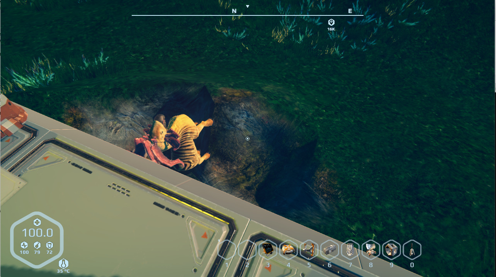

Crap, I screwed my garden. Now what?

Could not be easier. Well, it could, but whatever, we have a solution!

Place a Beacon on the hole as follows:

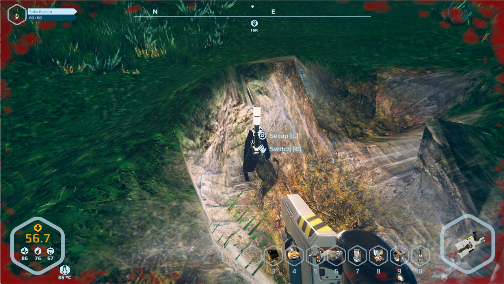

Be aware that the `restore_terrain` doesn't cares about your construction, so placing the `COMMAND beacon` too close (or setting it to broad) will bury your construction. Also, keep in mind that staying around may lead to your character being buried too - with all the unpredictable (and probably deadly) consequences. Stay out of reach - if unsure, but your character to rover way above the ground level. Just in case.

So, given this considerations, I choose to use **two** `COMMAND beacons` with 1.5 meters radius, instead of only one with 3 or 4 - this saved me the trouble from dig back my base:

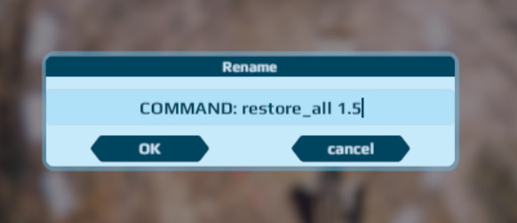

Overlapping `COMMANDS` are not a problem, so plant carefully your beacons and use the parameter to fine tune the reaching. 

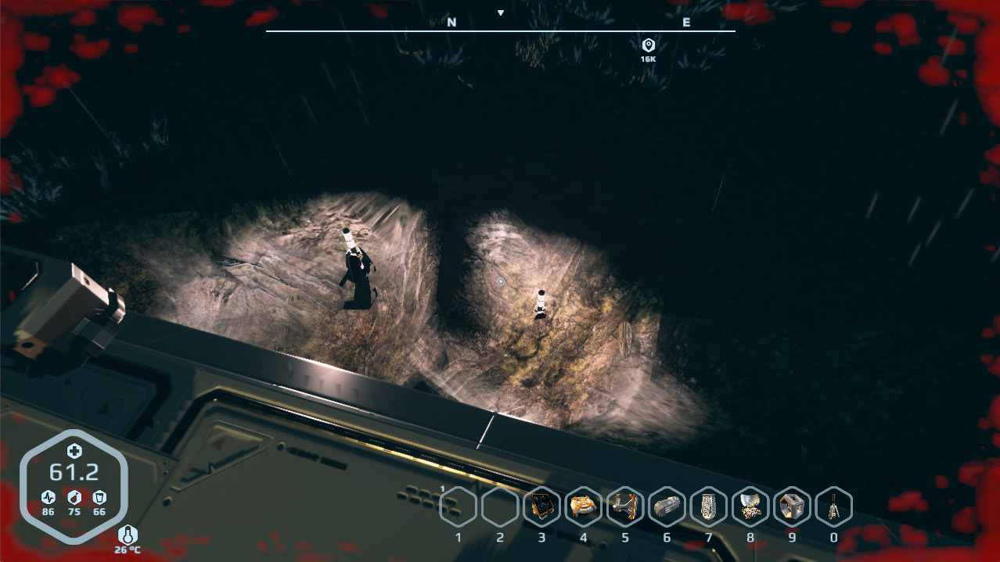

Now save the game (obviously), remember to give it a meaningful name so you don't misunderstand it later:

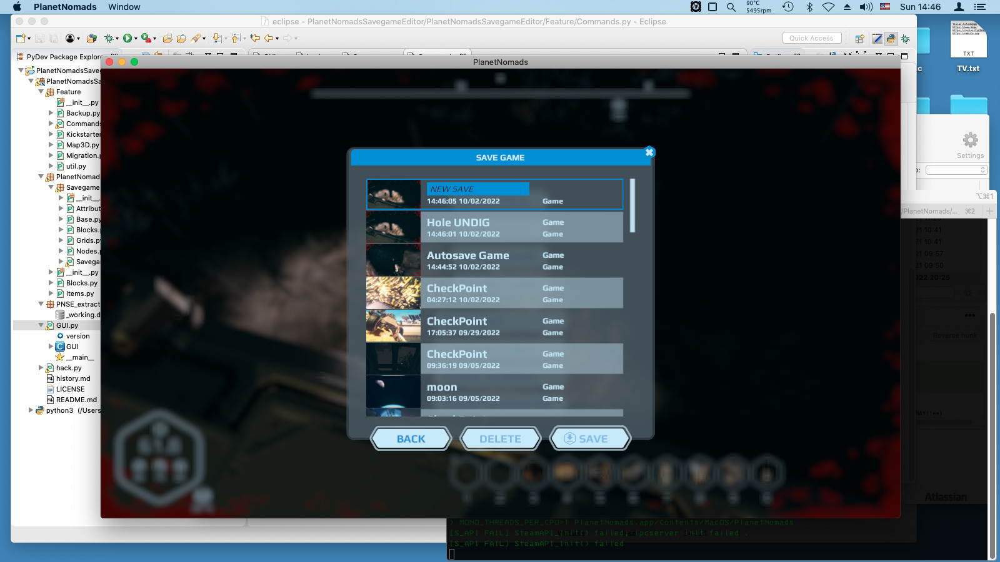

Load the PNSE tool and open the respective savegame. It will be the second newer, usually, as exiting PN will trigger an Auto Save and, so, this will be the newest one.

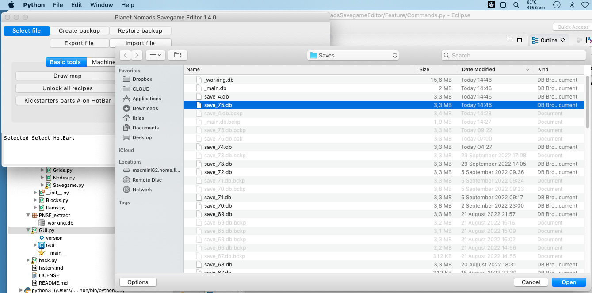

**And always do a backup!!** Really. This tool is **experimental**, after all, we are poking the thing without really knowing how it works. It's unavoidable that sooner or later something will be screw up due something we could not foresee while tinkering!

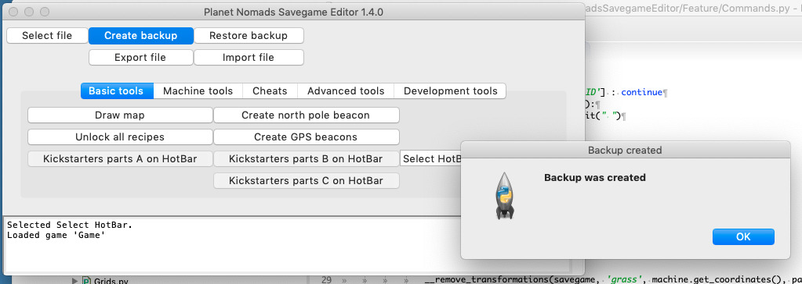

Go to `Advanced Tools` and click the `Execute Commands on Beacons` button.

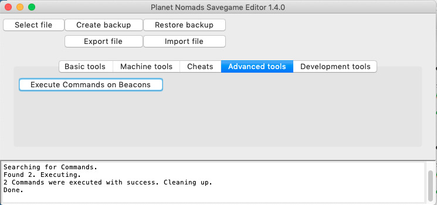

Save everything, go back to PN and load the savegame:

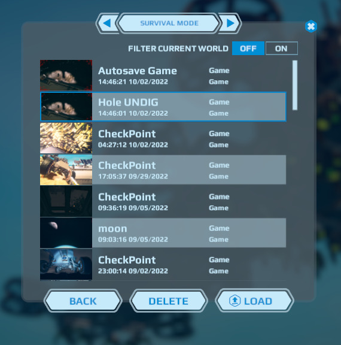

And **SUCCESS**!! :)

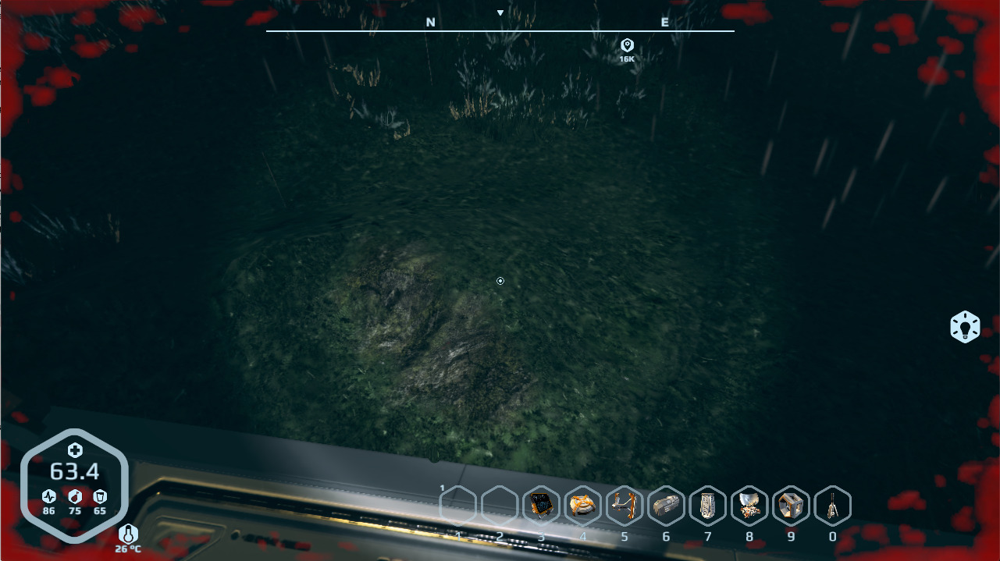
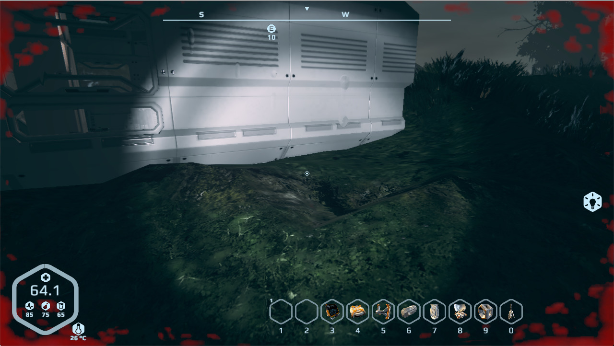

Happy undigging!

- - -
``
Lisias, 2022-10-02
``
